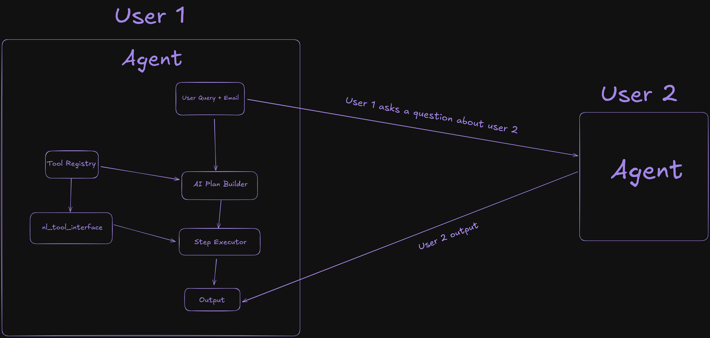

# 🤖 Agent-Based Action Planner and Step-by-Step Executor

This document outlines the implementation of an agent-based action planner and executor that can handle complex tasks by breaking them down into manageable steps. The system is designed to work with a variety of agents, each capable of performing specific actions.

## Architecture Overview

The diagram below illustrates the architecture of the agent-based action planner and executor system:




## **Components:**

- **User Query:** Input layer where User 1 provides a question.

- **AI Plan Builder:** Decomposes the query into actionable steps.

- **Tool Registry:** Lists tools, including inter-agent communication.

- **Step Executor:** Executes the plan.

- **nl_tool_interface:** Interfaces with tools or external agents.

- **Output:** Final result shown to User 1.

User 2’s Agent is an exact replica of User 1’s Agent, with the following roles:

- Acts as a data provider when User 1 queries about User 2.

- Responds through **contact_agent** or other interfaces.

### 🔠**Interaction Flow**

- User 1 asks a question that involves User 2.

- User 1’s Agent:

    - Parses the query.

    - Uses the **contact_agent** tool to reach out to User 2’s Agent.

- User 2’s Agent processes and returns relevant output.

- User 1’s Agent compiles the final output and returns it to User 1.

- If User 1 asks a question about User 1, the process is similar but uses User 1’s own agent.


## Detailed Architecture


The architecture consists of the following key components:
1. **Tool Registry**: A collection of tools that agents can use to perform actions.
    The Tool Registry includes various tools that agents can call upon to execute tasks. These tools include:
    
     - **ask_llm**: Directly queries the LLM for information.
     - **contact_agent**: Interfaces with another user agent to perform actions.
     - **get_calendar_events**: Retrieves calendar data for scheduling.
     - **get_chats**: Accesses past conversation logs for context.
     - **get_preferences**: Fetches user-specific preferences for personalized actions.
     - **get_transactions**: Retrieves user transaction history for financial tasks.
     - **list_contacts**: Provides contact information for communication tasks.

2. **AI Plan Builder**: Analyzes user requests and generates a step-by-step action plan. The plan builder uses the Tool Registry to determine which tools are needed for each step of the action plan. It breaks down complex tasks into smaller, manageable steps that can be executed sequentially.
3. **Step Executor**: Executes the action plan by calling the **nl_tool_interface** for each step. The output of each step is stored in memory as context for subsequent steps.
4. **nl_tool_interface**: The interface for executing LLM calls with the necessary context retrieved by the appropriate tool. This interface handles the interaction with the LLM and ensures that each step of the action plan has the required context to execute successfully.

5. **Output**: The result of the final step is returned to the user, providing a complete response to the original query.


## Agent Implementation

Each agent is implemented as a class that can handle specific actions. The agent's methods are designed to process messages, execute plans, and interact with other agents or tools as needed.

### Example Agent

```python
class Agent:

    def handle_message(self, message, history=None, agenda=None):
        # Implementation of the action
        pass
    def def execute_plan(self, plan):
        # Executes the action plan step by step
        pass
```
## Installation

1. Clone the repository:
   ```bash
   git clone <repository-url>
   cd <repository-directory>
   ```
2. Build the Docker image:
   ```bash
   docker compose -f "docker-compose.yml" up -d --build
   ```

   The endpoint will be available at `http://localhost:10003/run_agent`.

   parameters:
   - `user_email`: The email of the user for whom the action is being planned.
   - `instruction`: The user query that requires action planning.

3. Send a POST request to the endpoint with the following JSON body:

    `
    { "instruction": "Analyze the Calendar data and provide a comprehensive report on the users character profile.", "user_email": "arvindsarda84@gmail.com" }
    `

## Usage

To access the calendar programmatically, you need to set up a Google Calendar API service account and share the calendar with that service account. This allows the agent to retrieve calendar events and perform actions on behalf of the user.

- **Developer side:**
    1. Login to google console
    2. Create new project
    3. Create service account inside project
    4. Note the service account

- **Consumer side:**
    1. Go to calendar
    2. My calendar -> Settings and sharing -> Shared with 
    3. Add people and groups
    4. Email Id of the service account created
    5. Permission levels -> Make changes and manage sharing


To use the agent-based action planner and executor, follow these steps:

1. **Define Your Query**: Start with a user query that requires action planning.
   - Example: `message = "Analyze the Calendar data and provide a comprehensive report on the users character profile."`
2. **Set the User Email**: Specify the email of the user for whom the action is being planned.
   - Example: `user_email = "arvindsarda84@gmail.com"`
3. **Execute the Plan**: Use the executor to run the planned actions in the correct order.

```python
# Example usage
from agent import Agent

agent = Agent(user_email="arvindsarda84@gmail.com")
message = """
    Analyze the Calendar data and provide a comprehensive 
    report on the user's character profile.
"""

for step in agent.handle_message(message, history=None, agenda=None):

    yield step["content"]
```

## **output**
```
â”â”â”â”â”â”â”â”â”â”â”â”â”â”â”â”â”â”â”â”â”â”â”â”â”â”â”â”â”â”â”â”â”â”â”┠🧠 **Agent Plan for arvindsarda84@gmail.com** â”â”â”â”â”â”â”â”â”â”â”â”â”â”â”â”â”â”â”â”â”â”â”â”â”â”â”â”â”â”â”â”â”â”â”â”   
  1. I will get my preferences using get_preferences with user_id arvindsarda84@gmail.com.
  2. I will get my transactions using get_transactions with user_id arvindsarda84@gmail.com.
  3. I will get my chats using get_chats with user_id arvindsarda84@gmail.com.
  4. I will use ask_llm to analyze the retrieved preferences, transactions, and chats, and then provide a comprehensive report based on this data. 
  â”â”â”â”â”â”â”â”â”â”â”â”â”â”â”â”â”â”â”â”â”â”â”â”â”â”â”â”â”â”â”â”â”â”â”┠🔠**Executing 1** â”â”â”â”â”â”â”â”â”â”â”â”â”â”â”â”â”â”â”â”â”â”â”â”â”â”â”â”â”â”â”â”â”â”â”â” 
  **→ Executing:** I will get my preferences using get_preferences with user_id arvindsarda84@gmail.com.
   â”â”â”â”â”â”â”â”â”â”â”â”â”â”â”â”â”â”â”â”â”â”â”â”â”â”â”â”â”â”â”â”â”â”â”┠📣 **Result of Step 1** â”â”â”â”â”â”â”â”â”â”â”â”â”â”â”â”â”â”â”â”â”â”â”â”â”â”â”â”â”â”â”â”â”â”â”â” 

full_name: Arvind Sarda

likes:
  - Jazz music, vinyl record collecting
  - Cooking new cuisines, especially Italian
  - Photography, road cycling

gift_preferences:
  - Gourmet chocolates, wine, kitchen gadgets, coffee blends

party_preferences:
  - Enjoys wine-and-cheese nights, rooftop parties, and brunches
  - Likes planning themed events (retro, 80s, travel-inspired)

travel_preferences:
  - Wine trails, cultural tours, mountain biking holidays
  - Interested in international travel, prefers Airbnb stays

academic/career_interests:
  - Finance, entrepreneurship, culinary arts

social_style:
  - Calm, reserved in big groups but great conversationalist one-on-one

quirks:
  - Takes over the BBQ at every party, always suggests photo sessions
 â”â”â”â”â”â”â”â”â”â”â”â”â”â”â”â”â”â”â”â”â”â”â”â”â”â”â”â”â”â”â”â”â”â”â”┠🔠**Executing 2** â”â”â”â”â”â”â”â”â”â”â”â”â”â”â”â”â”â”â”â”â”â”â”â”â”â”â”â”â”â”â”â”â”â”â”â” 
**→ Executing:** I will get my transactions using get_transactions with user_id arvindsarda84@gmail.com. 
â”â”â”â”â”â”â”â”â”â”â”â”â”â”â”â”â”â”â”â”â”â”â”â”â”â”â”â”â”â”â”â”â”â”â”┠📣 **Result of Step 2** â”â”â”â”â”â”â”â”â”â”â”â”â”â”â”â”â”â”â”â”â”â”â”â”â”â”â”â”â”â”â”â”â”â”â”â” 
 [{'date': '2025-07-18', 'merchant': 'Cafe Coffee Day', 'category_group': 'Food & Drink', 'category': 'Coffee', 'item': 'Cafe Latte', 'amount': 494}, {'date': '2025-07-08', 'merchant': 'Pantaloons', 'category_group': 'Lifestyle', 'category': 'Garments', 'item': 'Dupatta', 'amount': 2665}, {'date': '2025-07-11', 'merchant': 'Adidas', 'category_group': 'Lifestyle', 'category': 'Shoes', 'item': 'Slippers', 'amount': 2822}, {'date': '2025-07-18', 'merchant': 'Pepperfry', 'category_group': 'Home & Decor', 'category': 'Home Decor', 'item': 'Sofa Throw', 'amount': 1058}, {'date': '2025-06-28', 'merchant': 'BookMyShow', 'category_group': 'Leisure', 'category': 'Recreation', 'item': 'Concert Ticket', 'amount': 3013}, {'date': '2025-07-20', 'merchant': 'Amazon', 'category_group': 'Electronics', 'category': 'Electronics', 'item': 'Wireless Mouse', 'amount': 5281}, {'date': '2025-07-15', 'merchant': 'Amazon', 'category_group': 'Home & Decor', 'category': 'Home Decor', 'item': 'Table Lamp', 'amount': 440}, {'date': '2025-07-06', 'merchant': 'Bowling Alley', 'category_group': 'Leisure', 'category': 'Recreation', 'item': 'Shoe Rental', 'amount': 835}, {'date': '2025-07-04', 'merchant': 'Amazon', 'category_group': 'Home & Decor', 'category': 'Home Decor', 'item': 'Table Lamp', 'amount': 2802}, {'date': '2025-07-24', 'merchant': 'Amazon', 'category_group': 'Home & Decor', 'category': 'Home Decor', 'item': 'Cushion Cover', 'amount': 835}, {'date': '2025-06-30', 'merchant': 'Reliance Fresh', 'category_group': 'Essentials', 'category': 'Groceries', 'item': 'Potatoes', 'amount': 274}, {'date': '2025-07-12', 'merchant': 'Amazon', 'category_group': 'Electronics', 'category': 'Electronics', 'item': 'Tablet', 'amount': 5030}, {'date': '2025-07-06', 'merchant': 'Reliance Fresh', 'category_group': 'Essentials', 'category': 'Groceries', 'item': 'Paneer', 'amount': 672}, {'date': '2025-07-18', 'merchant': 'Amazon', 'category_group': 'Electronics', 'category': 'Electronics', 'item': 'Webcam', 'amount': 14691}, {'date': '2025-06-25', 'merchant': 'Amazon', 'category_group': 'Electronics', 'category': 'Electronics', 'item': 'Webcam', 'amount': 6662}] 
 â”â”â”â”â”â”â”â”â”â”â”â”â”â”â”â”â”â”â”â”â”â”â”â”â”â”â”â”â”â”â”â”â”â”â”┠🔠**Executing 3** â”â”â”â”â”â”â”â”â”â”â”â”â”â”â”â”â”â”â”â”â”â”â”â”â”â”â”â”â”â”â”â”â”â”â”â” 
**→ Executing:** I will get my chats using get_chats with user_id arvindsarda84@gmail.com. 

â”â”â”â”â”â”â”â”â”â”â”â”â”â”â”â”â”â”â”â”â”â”â”â”â”â”â”â”â”â”â”â”â”â”â”┠📣 **Result of Step 3** â”â”â”â”â”â”â”â”â”â”â”â”â”â”â”â”â”â”â”â”â”â”â”â”â”â”â”â”â”â”â”â”â”â”â”â” 
[]
 â”â”â”â”â”â”â”â”â”â”â”â”â”â”â”â”â”â”â”â”â”â”â”â”â”â”â”â”â”â”â”â”â”â”â”┠🔠**Executing 4** â”â”â”â”â”â”â”â”â”â”â”â”â”â”â”â”â”â”â”â”â”â”â”â”â”â”â”â”â”â”â”â”â”â”â”â” 
 **→ Executing:** I will use ask_llm to analyze the retrieved preferences, transactions, and chats, and then provide a comprehensive report based on this data. 
 â”â”â”â”â”â”â”â”â”â”â”â”â”â”â”â”â”â”â”â”â”â”â”â”â”â”â”â”â”â”â”â”â”â”â”┠📣 **Result of Step 4** â”â”â”â”â”â”â”â”â”â”â”â”â”â”â”â”â”â”â”â”â”â”â”â”â”â”â”â”â”â”â”â”â”â”â”â” 
 ## Comprehensive Report: Arvind Sarda

This report provides a detailed profile of Arvind Sarda, synthesizing his stated preferences with recent transactional data to offer a holistic understanding of his interests, lifestyle, and habits.

### 1. Personal Profile & Core Interests

Arvind Sarda is an individual with a diverse range of interests spanning arts, culinary pursuits, and outdoor activities. He has a strong appreciation for:

*   **Music & Arts:** Particularly Jazz music and collecting vinyl records. A recent transaction for a concert ticket suggests an active engagement with live entertainment.
*   **Culinary Arts:** Enjoys cooking new cuisines, with a specific fondness for Italian. His academic/career interests also include culinary arts, indicating a deeper passion. He appreciates kitchen gadgets and gourmet chocolates as gifts.
*   **Photography:** A keen interest, often suggesting photo sessions at gatherings.
*   **Outdoor & Fitness:** Engages in road cycling and is interested in mountain biking holidays.
*   **Professional & Academic:** His career interests lie in Finance and Entrepreneurship, alongside Culinary Arts.

### 2. Social & Lifestyle Preferences

Arvind's social demeanor and lifestyle choices reflect a blend of reservedness and a desire for curated experiences.

*   **Social Style:** He is described as calm and reserved in large groups but transforms into a great conversationalist in one-on-one settings, suggesting he values deeper connections.
*   **Party Preferences:** He enjoys sophisticated social gatherings such as wine-and-cheese nights, rooftop parties, and brunches. He also has a creative side, enjoying the planning of themed events (retro, 80s, travel-inspired).
*   **Travel Preferences:** His travel interests are specific and experiential, including wine trails, cultural tours, and mountain biking holidays. He prefers international travel and opts for Airbnb stays, indicating a preference for authentic and localized experiences over traditional hotel accommodations.
*   **Gift Preferences:** Reflecting his diverse interests, preferred gifts include gourmet chocolates, wine, kitchen gadgets, and coffee blends. A recent coffee purchase aligns with this preference.

### 3. Spending Habits & Recent Activities

An analysis of Arvind's recent transactions provides insights into his current spending patterns:

*   **Electronics (Significant Spending):** A notable portion of his recent expenditure is on electronics, including a wireless mouse, a tablet, and two webcams. This suggests a need for or interest in technology, possibly for work, communication, or personal use.
*   **Home & Decor:** He has made several purchases for home decor items such as a sofa throw, two table lamps, and a cushion cover, indicating an investment in his living space.
*   **Leisure & Entertainment:** A concert ticket purchase aligns with his interest in music and arts. A visit to a bowling alley suggests a general interest in recreational activities.
*   **Food & Drink:** Regular purchases include coffee (Cafe Coffee Day) and groceries (Reliance Fresh for basic items like potatoes and paneer). The coffee purchase aligns with his stated gift preference for coffee blends.
*   **Lifestyle:** Transactions at Pantaloons (garments) and Adidas (shoes) indicate general personal shopping for clothing and footwear.

**Summary of Spending:** His recent spending is heavily skewed towards electronics and home improvements, with consistent engagement in leisure activities and daily essentials. While his stated interests are broad, recent transactions highlight practical needs and general leisure rather than direct purchases related to specific hobbies like vinyl collecting or road cycling gear.

### 4. Unique Traits & Quirks

Arvind possesses distinct quirks that add to his unique personality:

*   **BBQ Enthusiast:** He has a tendency to "take over the BBQ at every party," showcasing a hands-on and perhaps leadership role in social culinary settings. This aligns with his interest in cooking.
*   **Photography Advocate:** He "always suggests photo sessions," reinforcing his interest in photography and potentially his desire to capture memories or moments.

### 5. Overall Impression

Arvind Sarda is a thoughtful and multi-faceted individual who values quality experiences, whether it's through music, food, travel, or personal connections. Despite being reserved in larger groups, he is engaging one-on-one and enjoys planning social events. His interests are well-defined, ranging from the artistic to the adventurous, and he invests in both his personal space and technological needs. His quirks reveal a playful and hands-on approach to social gatherings, particularly around food and memory-making. 

â”â”â”â”â”â”â”â”â”â”â”â”â”â”â”â”â”â”â”â”â”â”â”â”â”â”â”â”â”â”â”â”â”â”â”â” ğŸ **Final Result** â”â”â”â”â”â”â”â”â”â”â”â”â”â”â”â”â”â”â”â”â”â”â”â”â”â”â”â”â”â”â”â”â”â”â”â” 

## Comprehensive Report: Arvind Sarda

This report provides a detailed profile of Arvind Sarda, synthesizing his stated preferences with recent transactional data to offer a holistic understanding of his interests, lifestyle, and habits.

### 1. Personal Profile & Core Interests

Arvind Sarda is an individual with a diverse range of interests spanning arts, culinary pursuits, and outdoor activities. He has a strong appreciation for:

*   **Music & Arts:** Particularly Jazz music and collecting vinyl records. A recent transaction for a concert ticket suggests an active engagement with live entertainment.
*   **Culinary Arts:** Enjoys cooking new cuisines, with a specific fondness for Italian. His academic/career interests also include culinary arts, indicating a deeper passion. He appreciates kitchen gadgets and gourmet chocolates as gifts.
*   **Photography:** A keen interest, often suggesting photo sessions at gatherings.
*   **Outdoor & Fitness:** Engages in road cycling and is interested in mountain biking holidays.
*   **Professional & Academic:** His career interests lie in Finance and Entrepreneurship, alongside Culinary Arts.

### 2. Social & Lifestyle Preferences

Arvind's social demeanor and lifestyle choices reflect a blend of reservedness and a desire for curated experiences.

*   **Social Style:** He is described as calm and reserved in large groups but transforms into a great conversationalist in one-on-one settings, suggesting he values deeper connections.
*   **Party Preferences:** He enjoys sophisticated social gatherings such as wine-and-cheese nights, rooftop parties, and brunches. He also has a creative side, enjoying the planning of themed events (retro, 80s, travel-inspired).
*   **Travel Preferences:** His travel interests are specific and experiential, including wine trails, cultural tours, and mountain biking holidays. He prefers international travel and opts for Airbnb stays, indicating a preference for authentic and localized experiences over traditional hotel accommodations.
*   **Gift Preferences:** Reflecting his diverse interests, preferred gifts include gourmet chocolates, wine, kitchen gadgets, and coffee blends. A recent coffee purchase aligns with this preference.

### 3. Spending Habits & Recent Activities

An analysis of Arvind's recent transactions provides insights into his current spending patterns:

*   **Electronics (Significant Spending):** A notable portion of his recent expenditure is on electronics, including a wireless mouse, a tablet, and two webcams. This suggests a need for or interest in technology, possibly for work, communication, or personal use.
*   **Home & Decor:** He has made several purchases for home decor items such as a sofa throw, two table lamps, and a cushion cover, indicating an investment in his living space.
*   **Leisure & Entertainment:** A concert ticket purchase aligns with his interest in music and arts. A visit to a bowling alley suggests a general interest in recreational activities.
*   **Food & Drink:** Regular purchases include coffee (Cafe Coffee Day) and groceries (Reliance Fresh for basic items like potatoes and paneer). The coffee purchase aligns with his stated gift preference for coffee blends.
*   **Lifestyle:** Transactions at Pantaloons (garments) and Adidas (shoes) indicate general personal shopping for clothing and footwear.

**Summary of Spending:** His recent spending is heavily skewed towards electronics and home improvements, with consistent engagement in leisure activities and daily essentials. While his stated interests are broad, recent transactions highlight practical needs and general leisure rather than direct purchases related to specific hobbies like vinyl collecting or road cycling gear.

### 4. Unique Traits & Quirks

Arvind possesses distinct quirks that add to his unique personality:

*   **BBQ Enthusiast:** He has a tendency to "take over the BBQ at every party," showcasing a hands-on and perhaps leadership role in social culinary settings. This aligns with his interest in cooking.
*   **Photography Advocate:** He "always suggests photo sessions," reinforcing his interest in photography and potentially his desire to capture memories or moments.

### 5. Overall Impression

Arvind Sarda is a thoughtful and multi-faceted individual who values quality experiences, whether it's through music, food, travel, or personal connections. Despite being reserved in larger groups, he is engaging one-on-one and enjoys planning social events. His interests are well-defined, ranging from the artistic to the adventurous, and he invests in both his personal space and technological needs. His quirks reveal a playful and hands-on approach to social gatherings, particularly around food and memory-making. 
```

## Conclusion

The agent-based action planner and executor system provides a robust framework for handling complex tasks by breaking them down into manageable steps. By leveraging the capabilities of various agents and tools, it can efficiently respond to user queries and execute plans in a structured manner. This architecture is adaptable and can be extended with additional agents or tools as needed, making it a versatile solution for action planning and execution.